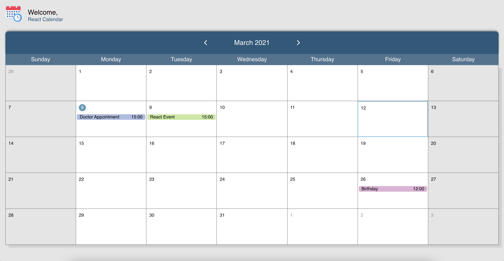
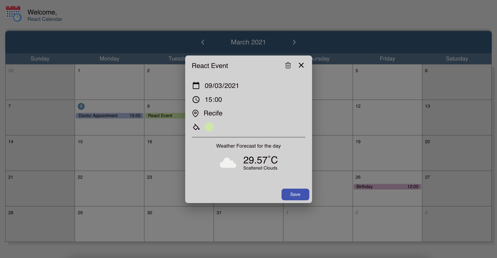

# React Calendar
<h1 align="center"></h1>

<div align="center">

   
</div>

<p align="center">A calendar created using react, with the new version 16 features and typescript</p>

<p align="center">
    
</p>


## 🚀 Getting Started
### 📥 Installing dependencies

Run:

```
cd frontend
yarn
```

### 🔩 External APIs
We are using a external API to fetch the weather forecast on reminders. We are using the [Open Weather](https://openweathermap.org/api), to properly use this api you must follow the steps below:

- Create a `.env` file in the same directory of `.env.example`.
- Copy the content inside `.env.example` in the `.env` file. 
- Now you must create an account on Open Weather site, so with that you will be able to create keys to use to fetch data.
- Paste your key in the `REACT_APP_WEATHER_API_KEY` property in the `.env` file:
```
REACT_APP_WEATHER_API_KEY=<YOUR_KEY>
```

### 🏎 Running application
Go to the frontend folder and run the following command to start the web application
```
yarn start
```

### 🔬 Running tests
To run the tests go to the frontend folder and run the following command
```
yarn test
```
### 📷 Screenshots
<p align="center">
    
    
</p>

## 🛠 Built With

* [ReactJs](https://reactjs.org/)
* [Yarn](https://yarnpkg.com/)
* [TypeScript](https://www.typescriptlang.org/)
* [axios](https://github.com/axios/axios)
* [styled-components](https://styled-components.com/)
* [date-fns](https://date-fns.org/)
* [Material UI](https://material-ui.com/)
* [Open Weather](https://openweathermap.org/api)


## 🎖 Author
* **Geraldo Braz** - *Initial work* - [@geraldobraz](https://github.com/geraldobraz)

## 📝 License

This project is licensed under the MIT License - see the [LICENSE.md](LICENSE.md) file for details

<div align="center">Icons made by <a href="https://www.freepik.com" title="Freepik">Freepik</a> from <a href="https://www.flaticon.com/" title="Flaticon">www.flaticon.com</a></div>